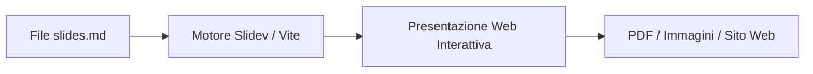

# Crea Presentazioni Moderne con Slidev
Dimentica PowerPoint: il potere di Markdown e dell'Open Source per i tuoi talk

<div class="pt-12">
  <span @click="$nav.next" class="px-2 py-1 rounded cursor-pointer hover:bg-white hover:bg-opacity-10">
    <carbon:arrow-right class="inline"/>
  </span>
</div>

---
layout: center
---

# Perché siamo qui?

- ⚡ **Abbandonare i formati chiusi**: Dire addio a layout disallineati e file binari pesanti (.pptx).
- 📝 **Pensare in Markdown**: Focalizzarsi solo sul contenuto senza perdersi nel trascinare box di testo.
- 🛠️ **Usare gli strumenti del mestiere**: Portare Git, codice formattato e componenti web direttamente nelle slide.

---

# Cos'è Slidev?

**Slidev** (*Slide + Dev*) è uno strumento open source ideato da Anthony Fu per creare presentazioni pensate per sviluppatori e appassionati di tecnologia.

* 📝 **Markdown-based**: L'intera presentazione vive in un unico file di testo (`slides.md`).
* ⚡ **Alimentato da Vite**: Aggiornamenti istantanei nel browser mentre digiti (Hot Module Replacement).
* 🎨 **Bello di default**: Temi eleganti, tipografia curata ed evidenziazione del codice integrata.
* 🧩 **Web-native**: Se conosci HTML, CSS o Vue.js, puoi creare qualsiasi animazione o componente su misura.

---

# Strumenti Tradizionali vs Slidev

<div class="grid grid-cols-2 gap-4 mt-6">
<div>

### Strumenti Classici (PowerPoint / Keynote)
- ❌ File proprietari e binari pesanti
- ❌ Versionare con Git genera conflitti impossibili
- ❌ Incollare codice significa perdere colori e indentazione
- ❌ Tanti clic per allineare pixel e margini

</div>
<div>

### Il metodo Slidev (Code & Markdown)
- ✅ File di testo puro leggibili ovunque
- ✅ Perfetto per Git (commit, branch, pull request)
- ✅ Evidenziazione sintattica professionale nativa
- ✅ Struttura automatica e design coerente

</div>
</div>

---

# Come funziona Slidev?



<div class="mt-8">

1. **Scrivi**: Redigi le tue slide in Markdown usando i tre trattini `---` per separare una pagina dall'altra.
2. **Visualizzi**: Un server locale apre la presentazione nel browser su `http://localhost:3030`.
3. **Esporti o Condividi**: Genera un PDF, un file PowerPoint o pubblica il sito statico su internet.

</div>

---

# I ferri del mestiere (Prerequisiti)

Gli stessi strumenti usati ogni giorno dagli sviluppatori software:

1. 💻 **Terminale**: La finestra di comando per avviare il progetto.
2. 🟢 **Node.js**: Il motore JavaScript (versione 18 o superiore consigliata).
3. 📝 **Editor di Testo**: VS Code o VSCodium (esiste anche l'estensione ufficiale *Slidev* per l'anteprima affiancata!).

---
layout: two-cols
---

# Step 1: Avviare il Progetto

Apri il terminale ed esegui il comando interattivo ufficiale:

```bash
npm create slidev@latest
```

Il terminale ti guiderà nella configurazione:
- *Project name*: `mia-presentazione`
- *Install dependencies?*: `Yes`

::right::

<div class="ml-4">

### Avvio della presentazione

Entra nella cartella appena creata:

```bash
cd mia-presentazione
```

Avvia il server di sviluppo:

```bash
npm run dev
```

Apri il browser su:
🌐 **`http://localhost:3030`**

Le modifiche che salvi in `slides.md` compariranno a schermo istantaneamente!

</div>

---

# Step 2: Anatomia di un file `slides.md`

Un singolo file contiene tutta la presentazione. Le slide sono divise da `---`:

```markdown
---
theme: seriph
title: Il mio primo talk
---

# Prima Slide
Benvenuti alla mia presentazione!

---
layout: center
---

# Seconda Slide
Questo testo è centrato automaticamente grazie al layout.

---

# Terza Slide
- Primo punto elenco
- Secondo punto elenco
```

---

# Step 3: Layout a Colonne

Suddividere lo spazio è semplicissimo grazie al layout `two-cols` e allo slot `::right::`:

<div class="grid grid-cols-2 gap-4 mt-4">
<div>

```markdown
---
layout: two-cols
---

# Colonna di Sinistra
Qui spieghi il concetto teorico:
- Punto A
- Punto B

::right::

# Colonna di Destra
Qui mostri un diagramma o un esempio!
```

</div>
<div>

<div class="p-4 bg-gray-100 dark:bg-gray-800 rounded-lg text-sm">
  <h4 class="font-bold text-base mb-2">Risultato visivo</h4>
  <p>Le due sezioni vengono disposte automaticamente al 50% di larghezza ciascuna, mantenendo margini perfetti su qualsiasi schermo.</p>
</div>

</div>
</div>

---

# Step 4: Codice con Evidenziazione Dinamica

Slidev supporta **Shiki** per colorare il codice ed evidenziare righe specifiche al cambio slide:

```javascript {1|3-4|6}
// 1. Definiamo la funzione di benvenuto
function salutaCommunity(nome) {
  const messaggio = `Ciao ${nome}, benvenuto nel software libero!`;
  console.log(messaggio);
}

salutaCommunity("Linux User");
```

<div class="mt-4 text-sm text-gray-400">
💡 Il blocco <code>{1|3-4|6}</code> attiva l'evidenziazione progressiva riga per riga ad ogni clic o pressione di freccia!
</div>

---

# Step 5: Animazioni di Comparsa (`v-click`)

Puoi mostrare i contenuti a tappe senza dover duplicare le slide:

<v-clicks>

- 🖱️ **Primo punto**: Compare al primo clic della barra spaziatrice.
- ⚡ **Secondo punto**: Compare al secondo clic.
- 🚀 **Terzo punto**: Puoi applicare `v-click` a qualsiasi elemento: liste, immagini, blocchi di codice!

</v-clicks>

<div class="mt-6">

```markdown
<v-clicks>

- Primo punto
- Secondo punto
- Terzo punto

</v-clicks>
```

</div>

---

# Tips & Tricks: La Vista Presentatore

Premi il pulsante **Presenter** nella barra strumenti o visita:
`http://localhost:3030/presenter`

<div class="grid grid-cols-3 gap-4 mt-6">
<div class="p-4 bg-gray-100 dark:bg-gray-800 rounded">

### ⏱️ Timer & Clock
Visualizza da quanti minuti stai parlando e l'ora attuale per non sforare i tempi.

</div>
<div class="p-4 bg-gray-100 dark:bg-gray-800 rounded">

### 👁️ Prossima Slide
Anteprima della slide successiva per anticipare il discorso al pubblico.

</div>
<div class="p-4 bg-gray-100 dark:bg-gray-800 rounded">

### 📝 Note Personali
Inserisci commenti leggibili solo da te aggiungendo note in fondo alla slide.

</div>
</div>

---

# Tips & Tricks: Funzionalità Avanzate

* ✏️ **Strumento Disegno**: Disegna direttamente sulle slide con la penna digitale integrata per evidenziare dettagli a voce.
* 🎥 **Registrazione & Webcam**: Mostra il tuo volto in un cerchio fluttuante sopra le slide e registra il talk in video.
* 🎨 **Centinaia di Icone Integrate**:
  Usa icone da qualsiasi libreria direttamente con tag HTML veloci:
  `<carbon:rocket />`, `<logos:linux-tux />`, `<logos:markdown />`.
* 💻 **Monaco Editor**: Rendi i blocchi di codice modificabili ed eseguibili in diretta durante la presentazione!

---

# Esportare e Pubblicare la Presentazione

Non sei legato al computer di sviluppo: puoi esportare il lavoro in diversi formati.

1. 📄 **Esportare in PDF o PPTX**:
   ```bash
   npm run export
   ```
2. 🌐 **Pubblicazione Web come SPA (Single Page Application)**:
   ```bash
   npm run build
   ```
   Genera una cartella `dist/` con file HTML statici pronti per essere ospitati gratuitamente su **GitHub Pages**, **Netlify** o **Vercel**.

---
layout: center
class: text-center
---

# Prossimi Passi

1. 🧑‍💻 **Installa Slidev**: Provalo in locale creando un mini-talk di 3 slide.
2. 📦 **Sfoglia i Temi Ufficiali**: Esplora temi della community per cambiare look con una sola riga nel frontmatter.
3. 🐙 **Salva su Git**: Traccia le modifiche dei tuoi talk come faresti con qualsiasi progetto open source.

> "Le migliori presentazioni nascono dalla chiarezza del messaggio, non dalla complessità degli effetti grafici."

---
layout: center
class: text-center
---

# Grazie per l'attenzione! 🚀

### Risorse Utili

- 🌐 **Sito Ufficiale**: [sli.dev](https://sli.dev)
- 📚 **Documentazione & Esempi**: [sli.dev/guide](https://sli.dev/guide)
- 🐙 **Repository GitHub**: [github.com/slidevjs/slidev](https://github.com/slidevjs/slidev)
